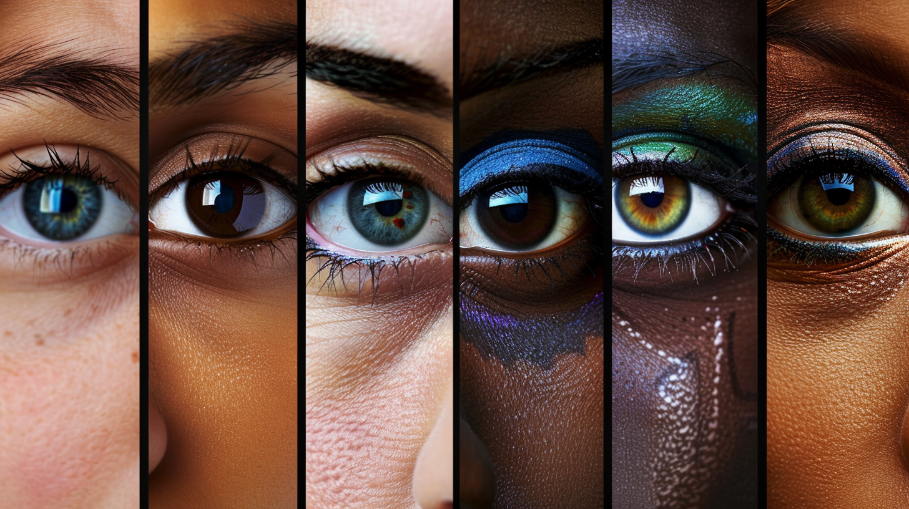
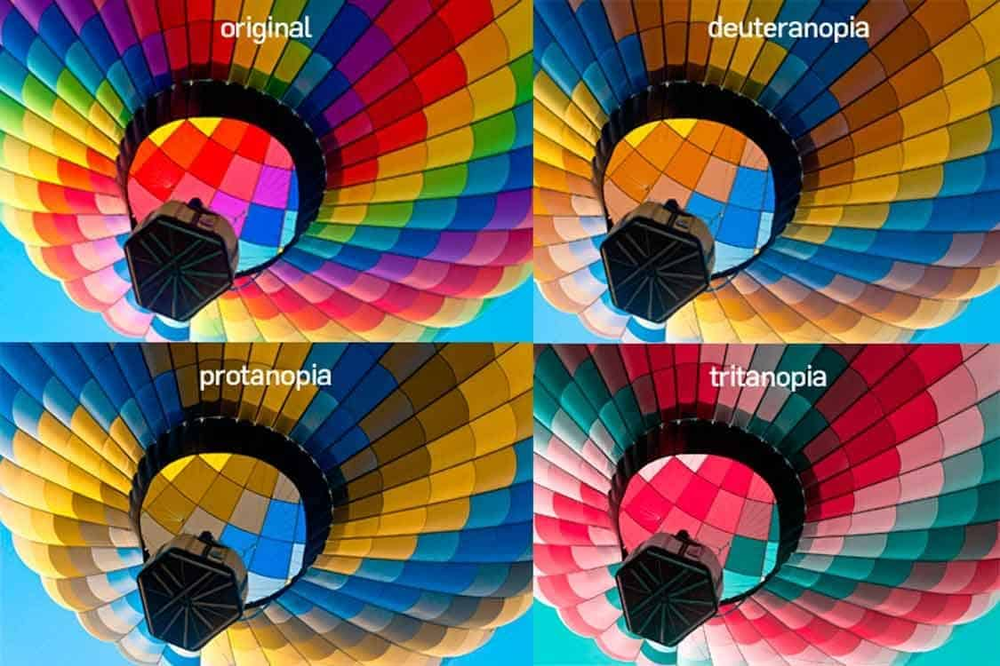

# Color In: Smart color explainer 🎨

## 🌈 Missão: Quebrando Barreiras Visuais para um Mundo Mais Inclusivo

Em um mundo onde a cor desempenha um papel vital em nossas vidas, 350 milhões de pessoas em todo o mundo lutam diariamente com o daltonismo, uma condição que dificulta a distinção de cores específicas. Este projeto visa fornecer uma solução inovadora, aproveitando a tecnologia do Google Gemini para transcrever cores em descrições acessíveis, tornando o mundo visual mais inclusivo para todos.

## 🌟 Motivação

A idéia do projeto surgiu de uma necessidade familiar. Meu irmão possui deuteranopia, uma variação do daltonismo referente a tons de verde e marrom. Durante toda a vida, teve muita dificuldade em trabalhar com cores, sendo por diversas vezes discriminado por professores e colegas por conta da dificuldade. Por mais que a deficiência tenha sido descoberta por John Dalton antes de 1800, o conhecimento popular acerca do daltonismo veio a público muito tempo depois. Infelizmente, o mundo não é pensado e criado para pessoas que apresentam quadros especiais. Criei esse projeto para tornar o mundo mais inclusivo para os daltônicos.

A ideia não se limita a esse público. Com poucos ajustes, podemos adaptar a solução para transcrever imagens e cores para pessoas portadoras de todos os tipos de deficiência visual, ampliando a área de atuação da solução e abraçando mais pessoas necessitadas.

## 👁️ Entendendo o Daltonismo: Tipos e Impactos

O daltonismo, também conhecido como deficiência de visão de cores, é comumente causado por uma anomalia nos cones sensíveis à cor na retina.
 
 
Existem diferentes tipos de daltonismo:

* Protanopia (Daltonismo Vermelho):

    Pessoas com protanopia têm dificuldade em distinguir tons de vermelho.
    Aproximadamente 1 em cada 12 homens e 1 em cada 200 mulheres são afetados.

* Deuteranopia (Daltonismo Verde):

    Semelhante à protanopia, mas com dificuldade em distinguir tons de verde. Aproximadamente 1 em cada 25 homens e 1 em cada 200 mulheres são afetados.

* Tritanopia (Daltonismo Azul):

    O tipo mais raro de todos. Essa condição dificulta a distinção entre azul e amarelo. Afeta cerca de 1 em cada 10.000 pessoas.

* acromatopsia (Cegueira total à cores):

    É a forma mais rara de daltonismo afetando menos de 0,01% da população. Nesta variação, o portador não enxerga cores.

## 💻 Tecnologia: Transcrição de Cores com Google Gemini

Nosso projeto utiliza a API Google Gemini, uma ferramenta de IA Generativa que pode analisar imagens e extrair descrições de cores. Ao incorporar o mecanismo de Gemini, podemos:

* Identificar com precisão as cores em uma imagem carregada pelo usuário.

* Determinar o tipo de daltonismo do usuário (se fornecido).

* Transcrever as cores nas descrições acessíveis, levando em consideração o tipo de daltonismo.

[!WARNING] 

Esse projeto foi criado para executar em um notebook do **Google Colab**. Recomendamos fortemente que você utilize essa plataforma para executar o código. Alguns ajustes pequenos podem ser necessários se utilizado através do Jupyter Notebook, AWS SageMaker, VS Code e similares. 

## 🤝 Impacto Social: Empoderando Indivíduos Daltônicos

Ao capacitar os daltônicos com informações precisas sobre cores, nosso projeto promove:

* Inclusão Aprimorada: Participação igualitária em atividades cotidianas que dependem da percepção das cores.

* Confiança Aumentada: Reduzir a ansiedade e a hesitação ao navegar em ambientes visuais complexos.

* Experiências Enriquecidas: Apreciar a beleza e as nuances das cores, anteriormente inacessíveis.

## 👣 Próximos passos

Esse projeto é uma experimentação. Isso significa que fora codificado para demonstrar as capacidades da solução, benefícios e barreiras a serem superadas.

Como qualquer solução, a idéia e expansível. Acredito que o uso da ferramenta aplicada possa ser benéfica em smartphones através da câmera, visão computacional para cenários de trabalho com artes visuais e até mesmo em realidade aumentada, potencializando a capacidade de identificação e interação com o ambiente.

## 📚 Referências

[National Eye Institute: Daltonismo](https://www.nei.nih.gov/learn-about-eye-health/eye-conditions-and-diseases/color-blindness)

[Organização Mundial da Saúde: Daltonismo](https://www.who.int/news-room/fact-sheets/detail/blindness-and-visual-impairment)

[API Google Gemini](https://ai.google.dev/gemini-api/docs?hl=pt-br)